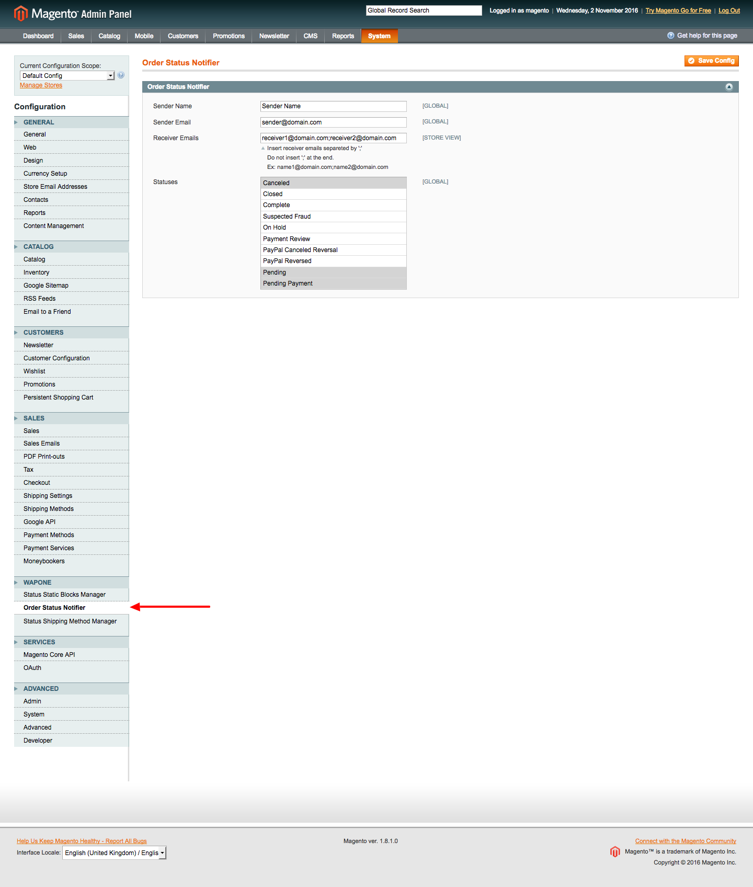

# WaPoNe_OrderStatusNotifier
A Magento extension to notify, sending an email,  when orders change their status

##Installation

### FTP/SFTP/SSH

1. Login into the backend, go to System — Cache Management and enable all types of cache.
2. Go to System — Tools — Compilation and make sure compilation is disabled.
3. Connect to your website source folder with FTP/SFTP/SSH and upload all the extension files and folders from “app” folder of the extension package to the root folder of your Magento installation.
Please use the “Merge” upload mode. Do not replace the whole folders, but merge them. This way your FTP/SFTP client will only add new files.
4. Go to System — Cache Management page under Magento backend and click “Flush Cache Storage” button. After this action, the extension is installed.
5. If you need to enable compilation, you can do it now at System — Tools — Compilation.
6. Please log out of the backend and log in again, so Magento can refresh permissions.

### Modman

### Composer

## User Guide

### Configuring extension

1. Go to System - Configuration - WaPoNe - Order Status Notifier.

2. Set *Sender Name*.
3. Set *Sender Email*.
4. Set *Receiver Emails*, a list of email separated by ";".
5. Select the order status changes to notify.

## Compability

- Magento CE:
  - 1.8.x
  - 1.9.x
